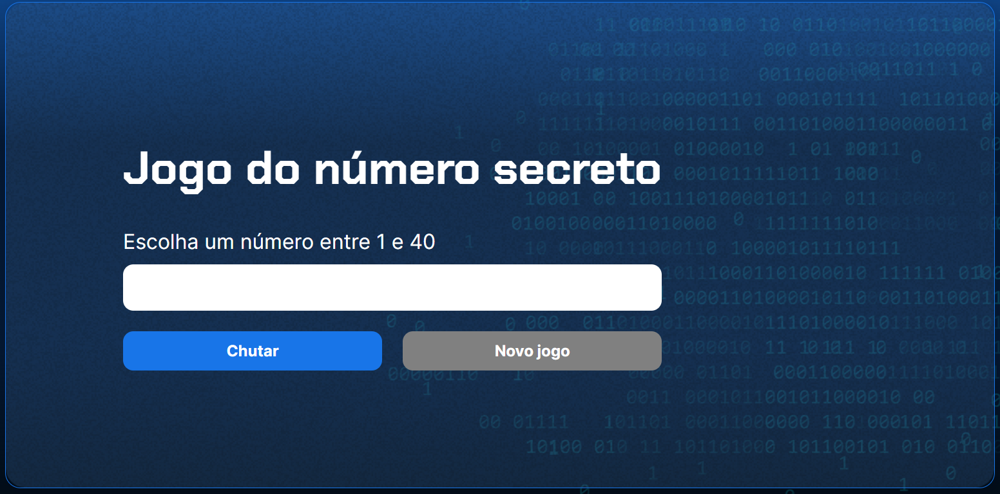

# Jogo de Adivinhação de Número

Este é um projeto de um jogo de adivinhação de número. O objetivo do jogo é adivinhar um número secreto gerado aleatoriamente pelo sistema, oferecendo dicas se o número chutado é maior ou menor que o número secreto.

<br></br>

## Interface

<div align="center">
  
</div>

<br></br>

## Sumário

- [Tecnologias Utilizadas](#tecnologias-utilizadas)
- [Status](#status)
- [Descrição](#descrição)
- [Funcionalidades](#funcionalidades)
- [Explicação](#explicação)
- [Estrutura do Projeto](#estrutura-do-projeto)
- [Como Usar](#como-usar)
- [Autor](#autor)

<br></br>

## Tecnologias Utilizadas

<div style="display: flex; flex-direction: row;">
  <div style="margin-right: 20px; display: flex; justify-content: flex-start;">
    
  </div>
  <div style="margin-right: 20px; display: flex; justify-content: flex-start;">
    
  </div>
  <div style="margin-right: 20px; display: flex; justify-content: flex-start;">
    
  </div>
</div>

<br></br>

## Status


<!-- -->

## Descrição

Este projeto é um jogo simples de adivinhação de número. O usuário deve escolher um número entre 1 e 40 e tentar adivinhar o número secreto gerado aleatoriamente pelo sistema. O jogo fornece feedback se o número chutado é maior ou menor que o número secreto e mantém o controle do número de tentativas.

## Funcionalidades

- Geração aleatória de um número secreto.
- Verificação do chute do usuário.
- Fornecimento de dicas sobre se o número secreto é maior ou menor que o chute.
- Contagem do número de tentativas.
- Opção de reiniciar o jogo após adivinhar corretamente.

## Explicação

```javascript
function verificarChute() {
  let chute = parseInt(document.querySelector("input").value);

  if (chute === numeroSecreto) {
    exibirTextoNaTela("h1", "Acertou!");
    let palavraTentativa = tentativas > 1 ? "tentativas" : "tentativa";
    let mensagemTentativas = `Você descobriu o número secreto com ${tentativas} ${palavraTentativa}!`;
    exibirTextoNaTela("p", mensagemTentativas);
    document.getElementById("reiniciar").removeAttribute("disabled");
  } else {
    if (chute > numeroSecreto) {
      exibirTextoNaTela("p", "O número secreto é menor");
    } else {
      exibirTextoNaTela("p", "O número secreto é maior");
    }
    tentativas++;
    limparCampo();
  }
}
```

## Como Usar

`1.` Clone o repositório para sua máquina local.

`2.` Abra o arquivo index.html em um navegador web.

`3.` Insira um número no campo de entrada e clique em "Chutar" para tentar adivinhar o número secreto.

## Autor

Desenvolvido por Diego Franco
